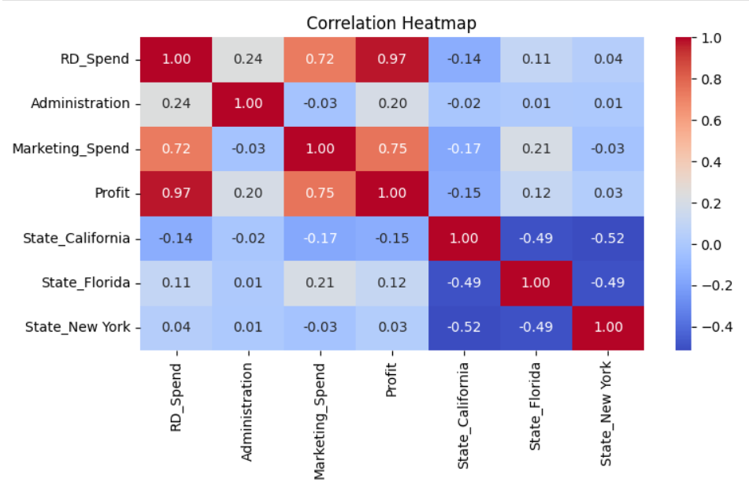
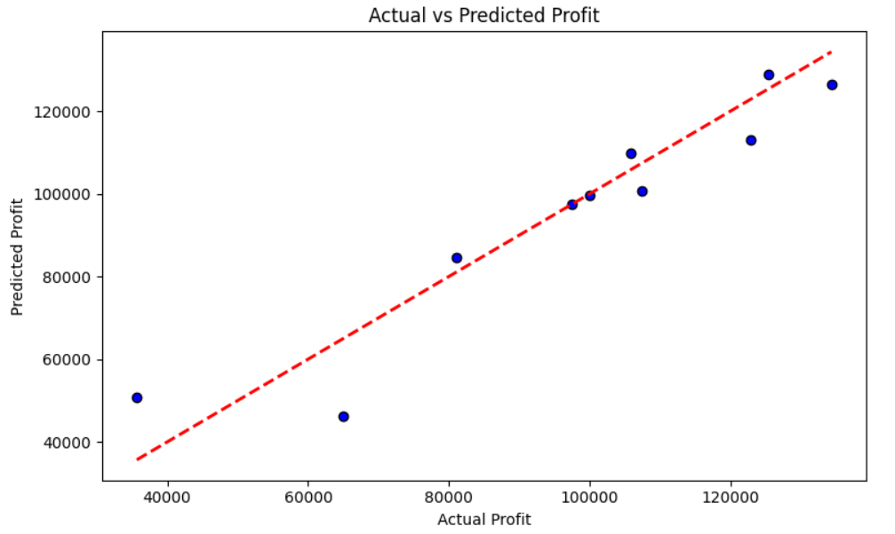
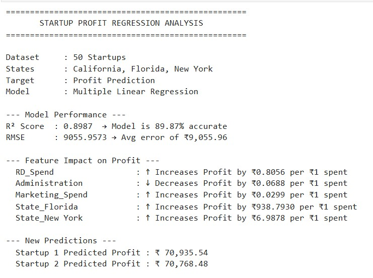
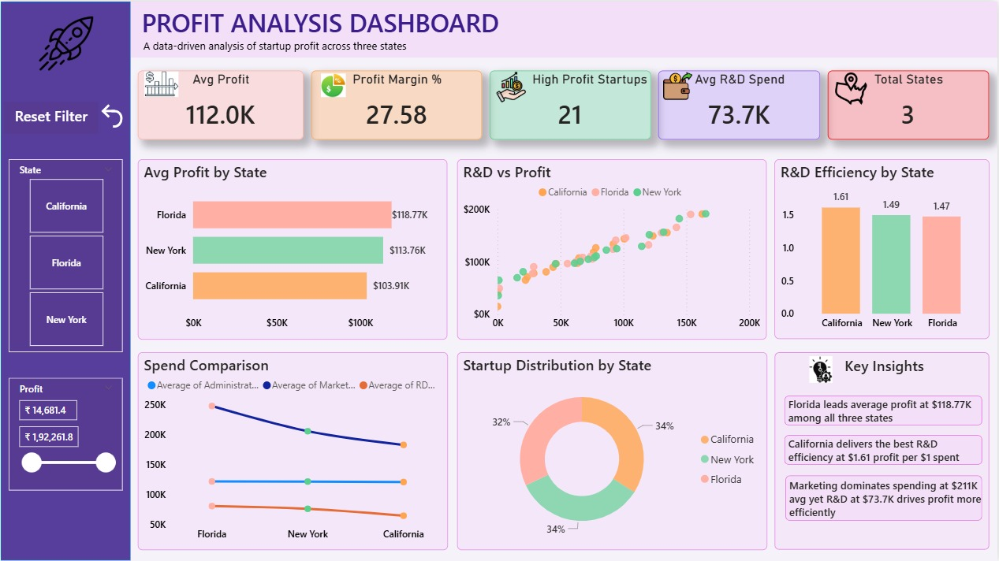

# Profit Analysis using Multiple Linear Regression

## Project Overview
This project analyzes business profit data 
and builds a Multiple Linear Regression model 
to predict profit based on multiple business 
variables, identifying key factors that most 
impact profitability.

---

## Objective
To analyze business data, identify correlations 
between multiple variables and profit, and build 
a Multiple Linear Regression model to forecast 
profit based on multiple input features.

---

## Tools & Technologies
| Tool | Purpose |
|------|---------|
| Python | Core programming |
| Pandas | Data manipulation |
| NumPy | Numerical operations |
| Matplotlib & Seaborn | Data visualization |
| Scikit-learn | Multiple Linear Regression |
| Jupyter Notebook | Development environment |
| Excel | Raw data source |

---

## Process
1. Data Collection & Understanding
2. Data Cleaning & Preprocessing
3. Exploratory Data Analysis (EDA)
4. Feature Selection & Correlation Analysis
5. Multiple Linear Regression Model Building
6. Model Evaluation (R², RMSE, MAE)
7. Profit Prediction & Visualization
8. Business Insights & Recommendations

---

## Machine Learning Used
- Algorithm — Multiple Linear Regression
- Multiple input variables used 
  for prediction
- Library — Scikit-learn
- Evaluation Metrics — R², RMSE, MAE

---

## Key Findings
- Identified key business variables 
  with highest impact on profit
- Built Multiple Linear Regression model 
  to predict profit accurately
- Analyzed correlation between 
  multiple input features and profit
- Delivered actionable recommendations 
  for business profitability via reports

---

## Visualizations

### Correlation Heatmap

### Actual vs Predicted Profit

### Regression Output Summary

### Dashboard Overview

---

## 📁 Files in this Repository
| File | Description |
|------|-------------|
| profit_analysis.ipynb | Main Python notebook |
| dataset.csv | Sample dataset (1000 records) |
| correlation_heatmap.png | Correlation heatmap |
| actual_vs_predicted.png | Regression plot |
| regression_output_summary.jpg | Regression Summary |
| dashboard.jpeg | Dashboard screenshot |

---

## 🏆 Outcome
Successfully built a Multiple Linear Regression 
model to predict business profit based on 
multiple input variables.
- Model accurately predicted profit 
  with R² score of 89.87%
- Identified top variablesz driving 
  profitability
- Predicted profit for two new startups
- Delivered data-driven recommendations 
  for improving business profit margins

---

## 👩‍💻 Author
**Preethi M**
Aspiring Data Analyst
📧 preethiii.m1905@gmail.com
🔗 [LinkedIn](your linkedin url here)
